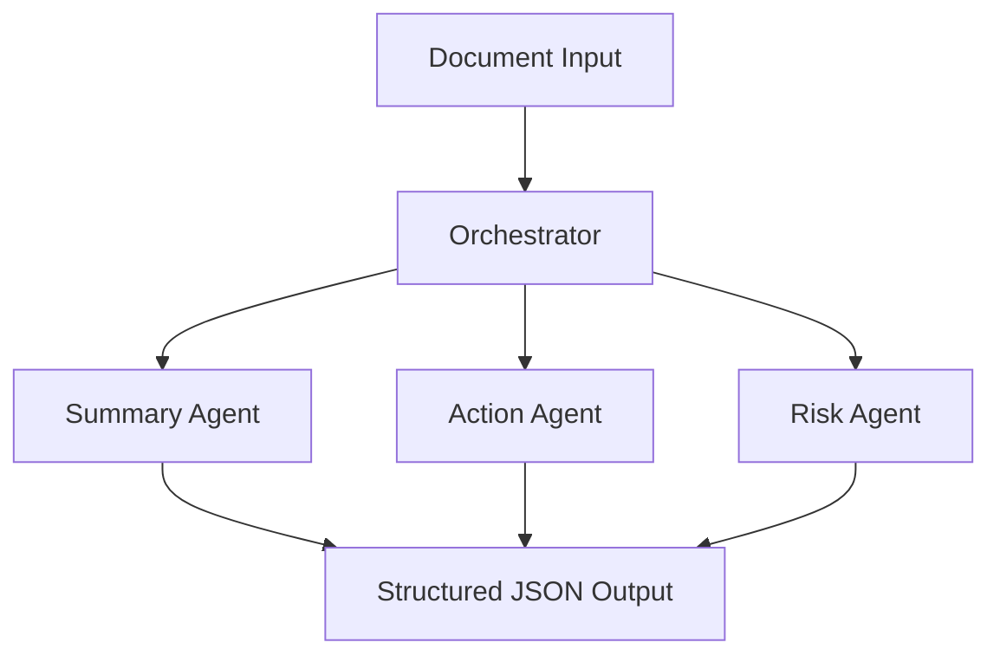

# Agentic AI Orchestrator

A multi-agent Agentic AI system for structured document intelligence.

This project demonstrates role-specialized autonomous agents coordinated through a central orchestration layer to extract:

- Executive Summary  
- Action Items (Owner, Department, Deadline)  
- Risks & Open Issues  

Unlike single-prompt LLM systems, this architecture separates intelligence across coordinated agents to improve reliability, accountability, and modular reasoning.

---

## Agentic Architecture

This system follows a modular multi-agent design:

### Orchestrator
- Splits long documents into manageable chunks  
- Coordinates specialized agents  
- Aggregates structured outputs  
- Enforces JSON schema validation  

### Summary Agent
- Context-aware summarization  
- Preserves decisions and constraints  
- Handles long-document chunking  

### Action Extraction Agent
- Extracts atomic task assignments  
- Captures owner, department, deadline  
- Prevents aggregation drift  
- Focuses on accountability  

### Risk & Issues Agent
- Identifies unresolved risks  
- Detects compliance gaps  
- Flags operational concerns  

---

## System Flow



---

## Tech Stack

- Python  
- AutoGen (Multi-Agent Framework)  
- Large Language Models (LLMs)  
- Streamlit (UI Layer)  
- JSON Schema Enforcement  

---

## Features

- Multi-agent orchestration  
- Role-based agent specialization  
- Structured JSON-only outputs  
- Deterministic post-processing  
- Long-document handling  
- Accountability-focused extraction  
- Clean Streamlit dashboard  

---

## Project Structure

```
agentic-ai-orchestrator/
│
├── agents/
│   ├── action.py
│   ├── summary.py
│   ├── risk.py
│   ├── base.py
│   └── __init__.py
│
├── tests/
│   └── test_agents.py
│
├── app.py
├── orchestrator.py
├── document_parser.py
├── requirements.txt
├── .env.example
└── README.md
```

---

## Run Locally

1. Clone the repository:

```bash
git clone https://github.com/yourusername/agentic-ai-orchestrator.git
cd agentic-ai-orchestrator
```

2. Create virtual environment:

```bash
python -m venv venv
venv\Scripts\activate   # Windows
# source venv/bin/activate  # Mac/Linux
```

3. Install dependencies:

```bash
pip install -r requirements.txt
```

4. Add environment variables:

Create `.env` file:

```
OPENAI_API_KEY=your_api_key_here
```

5. Run the application:

```bash
streamlit run app.py
```

---

## Example Output (Structured JSON)

```json
{
  "executive_summary": "...",
  "actions": [
    {
      "id": "A1",
      "description": "Finalize database schema",
      "owner_name": "Meera",
      "owner_department": "Data Engineering",
      "deadline": "Feb 25",
      "priority": "High"
    }
  ],
  "risks_open_issues": [
    {
      "id": "R1",
      "description": "Latency may exceed target threshold",
      "impact": "Medium"
    }
  ]
}
```

---

## Key Agentic AI Concepts Implemented

- Agent specialization  
- Task decomposition  
- Orchestrated multi-agent workflow  
- Structured output enforcement  
- Accountability-driven extraction  
- Deterministic validation layer  

---

## Future Improvements

- Inter-agent memory  
- Dependency extraction between tasks  
- Confidence scoring  
- Automated evaluation metrics  
- Agent-to-agent reasoning  

---

## Why This Project Matters

This is not a simple LLM wrapper.

It demonstrates:

- Modular agent design  
- Enterprise-style orchestration  
- Structured reasoning systems  
- Accountability-focused AI extraction  
- Real-world workflow automation  

This architecture is aligned with emerging Agentic AI systems used in enterprise environments.

---


---

## License

MIT License